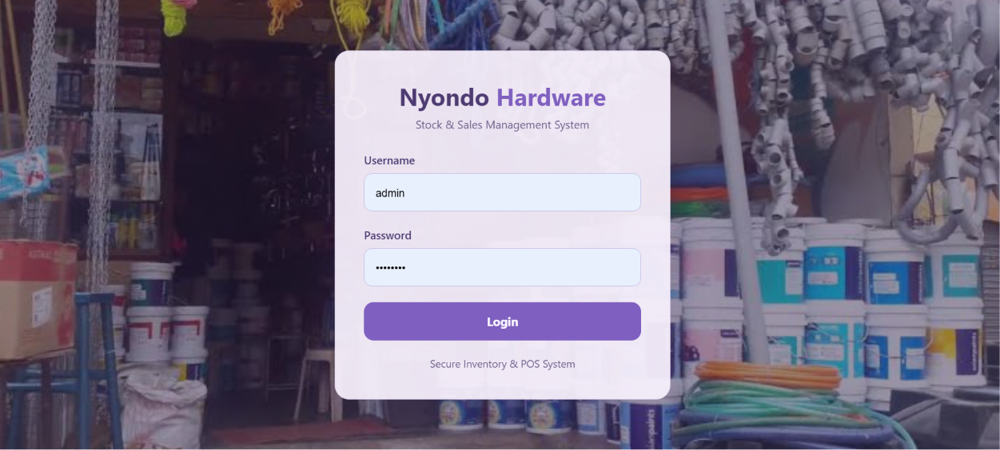

# NYONDO Hardware Management System (NyondoStock)

## 📌 Project Overview

**NyondoStock** is a web-based Hardware Management System developed for **NYONDO General Hardware LTD**, a wholesale and retail hardware business located in Nansana, Uganda.

The system was designed to solve challenges faced in manual stock management, sales tracking, supplier credit management, customer deposit tracking, transport calculations, and business reporting.

The goal of this project is to provide a reliable, simple, and efficient digital solution that helps hardware businesses manage their daily operations, reduce errors, and make better business decisions through organized data management.

---

# 🎯 Problem Statement

Many hardware businesses still depend on manual record keeping for:

- Stock registration
- Sales recording
- Supplier credit tracking
- Customer deposit schemes
- Transport charges
- Business reports

These manual processes can lead to:

- Stock inaccuracies
- Loss of sales records
- Difficulty tracking supplier debts
- Calculation errors
- Slow decision-making

NyondoStock provides an automated system that centralizes all business operations in one platform.

---

# 🚀 Features

## 1. Stock Management

The system allows authorized users to:

- Add new hardware products
- Update stock information
- Track available quantities
- Record product costs and selling prices
- Monitor stock movement

Examples of managed products:

- Cement
- Iron bars
- Nails
- Wheelbarrows
- Wire mesh
- Barbed wire
- Iron sheets

[Stock Management](screenshots/stock.png)

## 2. Sales Management

The sales module enables sales attendants to:

- Record customer purchases
- Calculate total sales automatically
- Track sold products
- Maintain sales history

Business rules include:

- Selling price must be greater than cost price
- Stock quantity must be available before selling

[Sales Management](screenshots/sales.png)

## 3. Supplier Credit Management

This module helps the business manage suppliers who provide goods on credit.

Features include:

- Recording supplier information
- Tracking credit purchases
- Monitoring outstanding balances
- Recording payments made

---

## 4. Customer Deposit Scheme Management

The system supports customers who make deposits before purchasing goods.

Features:

- Register customer deposits
- Track deposit balances
- Monitor customer payments
- Maintain transaction history

---

## 5. Transport Automation

The system automatically calculates transport charges based on business rules.

Rules:

- Free transport is provided within 10km for purchases above UGX 500,000
- Other deliveries attract a transport fee of UGX 30,000

This reduces manual calculation errors.

---

## 6. User Authentication and Role Management

The system has different user roles:

### Admin

Responsible for:

- Managing the entire system
- Viewing reports
- Managing users
- Monitoring business activities

[Sales Management](screenshots/adm.png)

### Store Manager

Responsible for:

- Managing stock
- Monitoring inventory levels
- Updating product information

### Sales Attendant

Responsible for:

- Recording sales
- Managing customer transactions

---

# 🛠️ Technologies Used

## Backend

- Python
- Django Framework

## Frontend

- HTML5
- CSS3
- Bootstrap

## Database

- SQLite

## Other Tools

- Git & GitHub
- Django Authentication System
- Django ORM
- Render Deployment

---

# 🏗️ System Architecture

The project follows the Django **Model-Template-View (MTV)** architecture.

### Model

Responsible for managing database structures including:

- Stock
- Sales
- Supplier Credit
- Customer Deposits
- Users
- Audit Logs

### Template

Handles the user interface using:

- HTML
- CSS
- Bootstrap

### View

Processes user requests and controls application logic.

---

# 📂 Project Structure
